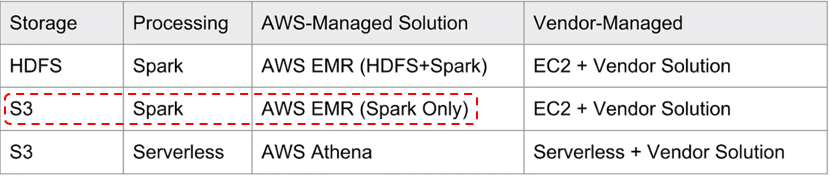
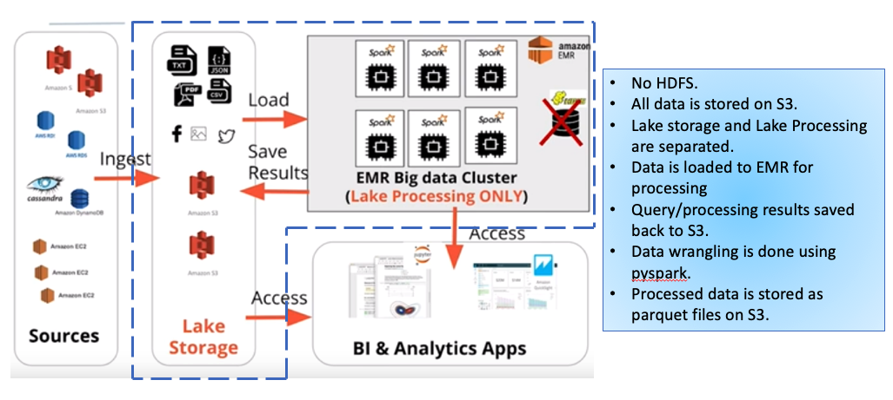
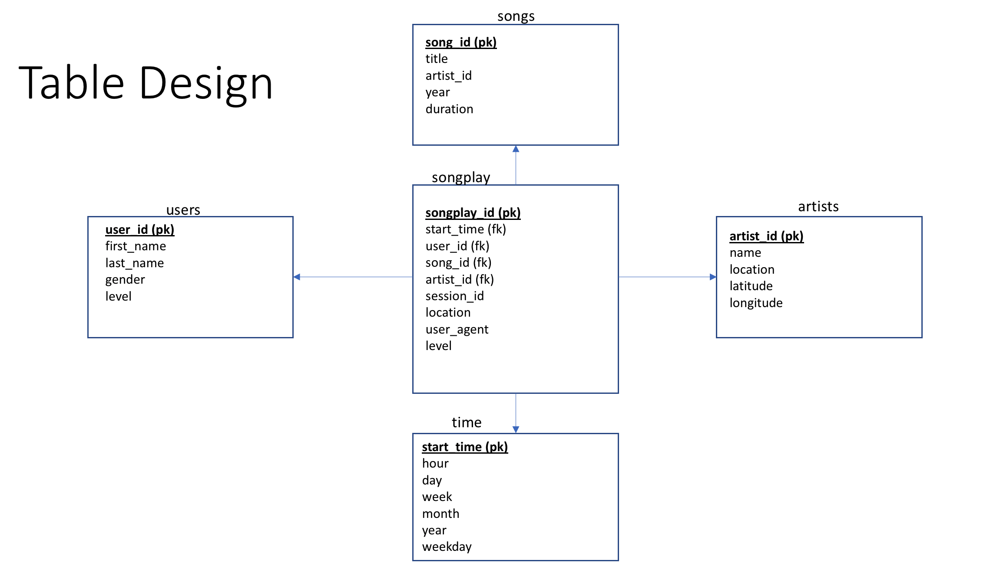
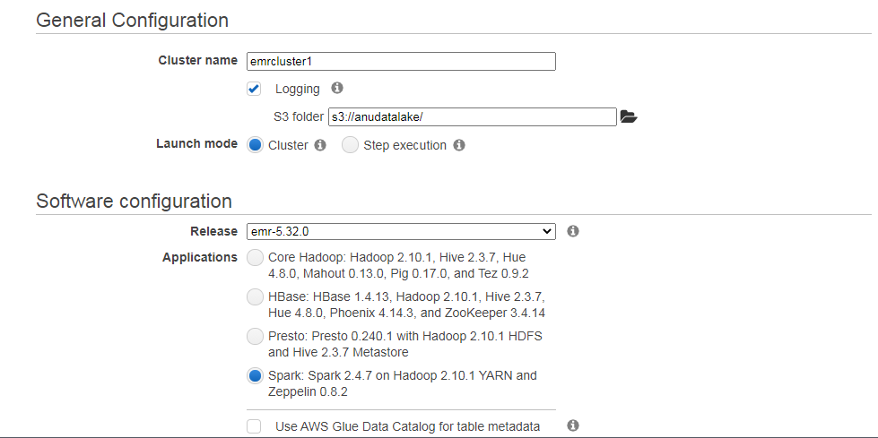
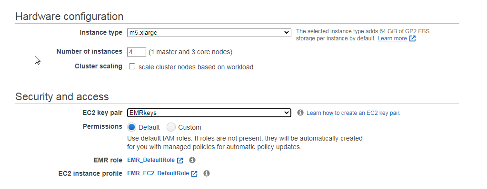

# Projects: Data lake processing using Spark
* Sparkify is a startup company working on a music streaming app. Through the app, Sparkify has collected information about user activity and songs, which is stored as a directory   of JSON logs (log_data - user activity) and a directory of JSON metadata files (song-data - song information). These data resides in S3 on AWS s3//udacity-den.

* In order to improve the business growth, Sparkify wants to move their processes and data onto the Data Lake on the cloud.

* In this project we build an ETL pipeline that extracts the data from S3, processes the data into analytics tables using Spark on an AWS cluster, and loads the data back into 
  S3 as a set of dimensional tables for the Sparkify analytics team to continue finding insights in what songs their users are listening to.
  
# Choosing a Data Lake on AWS:
* We will be using Spark for processing and AWS EMR as our managed solution, and S3 for retrieving and storing our data. A pictorial representation is shown below.

  
 
 * Lake Storage: S3
 * Lake Processing: Spark
 
 * The key thing to note here is that even though I am using AWS EMR, I am not using HDFS for lake storage, instead I am using S3 as my storage. Data is loaded into EMR for
   processing and the query/processing results are stored back into S3. Data Wrangling is done using pyspark and the processed data is stored back to S3 as parquet files.

   

# Project Files:
* etl.py: The script reads song_data and load_data from S3, transforms them to create five different tables, and writes them to partitioned parquet files in table directories on           S3.
* dl.cfg: Contains credentials for accessing S3.

# Project workflow :
 * etl.py script makes use of PySpark to wrangling the data. It starts off by reading song_data and load_data from S3, transforms them to create five different tables, and     
   writes them to partitioned parquet files in table directories on S3.
   
* Star Schema :

  

# Running the project on EMR:
* Create a Data Lake with Spark and AWS EMR.
 To create an Elastic Map Reduce data lake on AWS, use the following steps:

1> Create a ssh key-pair to securely connect to the EMR cluster that we are going to create. Go to your EC2 dashboard and click on the key-pairs. Create a new one, you will get    .pem file that you need to use to securely connect to the cluster.

2> Next, create an EMR cluster with the following configuration. Here EMR operates Spark in YARN cluster mode and comes with Hadoop Distributed file system. We will use a 4        cluster node with 1 master and 3 worker nodes.
* Configuration :
    
  
    

  Image

# Submitting Spark Jobs to the cluster:
* Once the cluster is ready, we can ssh into the master node from your terminal session. This will connect you to the EMR cluster.
* Copy files to /home/hadoop and then run the spark-submit command to submit your spark jobs.
* The parquet files are generated in S3.

